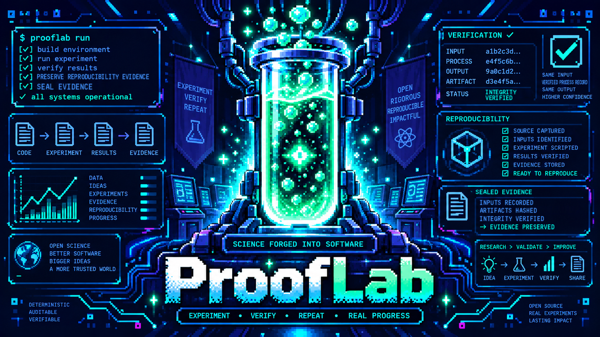

# ProofLab

ProofLab is a local-first Python CLI for reproducible engineering experiments
and independently verifiable evidence, maintained by Quantum Grove LLC.
Define inputs and implementation variants,
run serial trials from captured source, compare typed measurements under an
explicit policy, and generate reports from verified records.

**v0.1.0** is free and open source under the MIT license. The runtime uses only the Python standard
library: no third-party packages, cloud service, or AI dependency is required.

## Install

Requires Python **3.11+**, with `venv` and `pip` available for installation.
Full CLI qualification covers **Python 3.12.3 on Linux/WSL**. GitHub Actions
also passes all 418 synthetic regression tests on Ubuntu with **Python 3.11,
3.12, and 3.13**. macOS is **NOT TESTED**. Native Windows is **NOT TESTED** and
has a known limitation: `init` requires POSIX no-follow directory handles and refuses there.
Use WSL for the qualified workflow. Other Linux environments beyond these CI
runners are not separately qualified.

Install from [PyPI](https://pypi.org/project/prooflab/) in a virtual environment,
using a POSIX shell:

```sh
python3 -m venv .venv
. .venv/bin/activate
python -m pip install prooflab
prooflab --version
prooflab --help
```

For offline installation, download `prooflab-0.1.0-py3-none-any.whl` from the
[v0.1.0 GitHub release](https://github.com/stevenaustenlynn/prooflab/releases/tag/v0.1.0).
With the virtual environment activated, install from the directory containing
the wheel:

```sh
python -m pip install --no-index --no-deps ./prooflab-0.1.0-py3-none-any.whl
```

The wheel includes all starter and animation resources. The source distribution
also includes public documentation, schemas, examples, and the runnable synthetic
regression suite. Building from source requires locally available build tooling
(`build`, `setuptools>=61`, and `wheel` for the qualified backend). With those
already available, run `python -m build --no-isolation` in the extracted source;
set `PIP_NO_INDEX=1` to prevent dependency index use. Build tools are not runtime
dependencies. No dependencies need downloading to install the wheel above.

## Quick start

Use a fresh destination whose parent exists. The following POSIX-shell workflow
was exercised against an installed distribution, outside the repository.
The starter uses `python3` on PATH for its experiment subprocesses.

```sh
prooflab init sum-project
cd sum-project

# Capture the actual evidence paths printed by each command.
prooflab run experiment.toml --variant iterative > iterative.log
prooflab run experiment.toml --variant formula > formula.log
prooflab run experiment.toml --variant incorrect > incorrect.log
ITERATIVE_RUN=$(sed -n 's/^evidence_directory=//p' iterative.log)
FORMULA_RUN=$(sed -n 's/^evidence_directory=//p' formula.log)
INCORRECT_RUN=$(sed -n 's/^evidence_directory=//p' incorrect.log)

prooflab verify "$ITERATIVE_RUN"
prooflab verify "$FORMULA_RUN"
prooflab verify "$INCORRECT_RUN"
prooflab compare "$ITERATIVE_RUN" "$FORMULA_RUN" --policy comparison-policy.toml > pass.log

# Expected scientific rejection: explicitly handle compare's exit code 1.
if prooflab compare "$ITERATIVE_RUN" "$INCORRECT_RUN" --policy comparison-policy.toml > fail.log; then
    echo 'Unexpected comparison PASS'
else
    test "$?" -eq 1
fi
PASS_COMPARISON=$(sed -n 's/^evidence_directory=//p' pass.log)
FAIL_COMPARISON=$(sed -n 's/^evidence_directory=//p' fail.log)
prooflab verify "$PASS_COMPARISON"
prooflab verify "$FAIL_COMPARISON"
prooflab report "$PASS_COMPARISON" --output pass-report.md
prooflab report "$FAIL_COMPARISON" --output fail-report.md
```

The iterative and formula answers are 10; the deliberately incorrect answer is
9. All three runs complete operationally and verify. Their comparisons produce
PASS and FAIL respectively. Both comparison packages verify, and both reports
render successfully. **Verification and successful reporting do not mean
scientific acceptance.**

## Commands and evidence

| Command | Purpose |
| --- | --- |
| `init [DIRECTORY]` | Create the five-file starter; refuse collisions without overwriting. |
| `run EXPERIMENT --variant NAME` | Validate materials, capture exact bytes, run isolated trial directories, retain streams/declared outputs and seal evidence. |
| `compare BASELINE CANDIDATE --policy POLICY` | Verify compatible runs and compare their typed measurements without rerunning code. |
| `report PACKAGE [--output NEW_FILE]` | Render verified evidence as Markdown to stdout or a new external file. |
| `verify PACKAGE [--expect-sha256 DIGEST]` | Recompute SHA-256 identities and supported record relationships offline. |

Runs live under the experiment project's `.prooflab/runs/`; comparisons live
under the invoking directory's `.prooflab/comparisons/`. Each command prints its
actual evidence directory. `SEALED` means assembly completed and the resulting
package passed offline verification; it does not make files immutable.

Evidence binds protocol, plan, source/input snapshots, exact stdout/stderr,
declared outputs, measurements, and execution accounting with a manifest.
Built-in measurements include SHA-256, byte count, UTF-8 text, JSON scalar,
exit code, and recorded duration. Missing values remain explicit, never zero.

`manifest.sha256` checks local consistency. For an independently supplied
manifest identity, use `verify --expect-sha256` with a trusted 64-digit SHA-256.
This is not a signature system. Verification never imports or executes retained
code and does not prove authenticity, historical execution, or scientific truth.
Comparison packages retain operands and policy; full lineage also requires the
original run packages with matching manifest identities.

## Exit codes and failures

| Command | 0 | Other exits |
| --- | --- | --- |
| `init` | Created starter | 2: invocation, collision or creation failure |
| `run` | Operational completion, sealed | 2: invalid configuration; 3: sealed execution failure, timeout or interruption; 4: evidence/integrity failure |
| `compare` | Scientific PASS | 1: scientific FAIL; 2: invalid/incompatible input; 3: INCONCLUSIVE; 4: sealing failure |
| `verify` | VERIFIED | 1: INVALID; 2: invalid invocation; 3: INCOMPLETE; 4: UNSUPPORTED |
| `report` | Verified evidence rendered | 1: INVALID; 2: invocation/output failure; 3: INCOMPLETE; 4: UNSUPPORTED |

A zero-exit experiment can produce a wrong answer. A failed experiment can
produce valid evidence. Report exit 0 describes rendering, regardless of the
scientific verdict. Timeouts and nonzero child exits preserve accounting and
allow later trials; Ctrl-C stops the active child and accounts for skipped
trials. Abrupt kills can leave incomplete evidence; there is no automatic resume.
Reports refuse existing files or destinations inside evidence. Initialization
retains and lists partial creations if an actual write fails.

## Determinism and trust boundaries

Fixed captured inputs, normalized protocols, typed operands, and policies yield
deterministic identities and comparison results. Reports over identical verified
bytes are stable after relocation. Full run packages are **not byte-reproducible**:
run IDs, timestamps, elapsed times, and environment provenance can differ.
Programs may also depend on their interpreter, libraries, environment, host
state, or external services. ProofLab does not guarantee repeatable answers
across arbitrary environments. Recorded durations are not benchmark findings.

**Experiment execution is not a security sandbox.** Only run trusted programs.
Children inherit the caller's environment and permissions; snapshot directories
do not isolate the host. Exact source, definitions, streams and outputs are
unredacted and may contain sensitive data. Review evidence before sharing.
Verification expects a stable local tree and has no adversarial memory/time
budget. POSIX cleanup targets the child's process group; detached descendants
can escape it. Other platforms terminate only the direct child.

## Optional flask animation

```sh
prooflab run experiment.toml --variant iterative --animation truecolor
prooflab run experiment.toml --variant iterative --animation monochrome
prooflab run experiment.toml --variant iterative --animation off
```

Default: **off**. The accepted V6B artwork uses 24 frames, 32 × 36 cells, at
approximately 12 FPS. Rendering removes the exterior matte with the
terminal's default background (`SGR 49`), preserving the artwork and its interior.
The 48 original truecolor/monochrome resources remain unchanged.

Playback requires a supported UTF-8 POSIX terminal, at least **33 columns × 37
rows**, and all three standard streams connected to the same foreground TTY.
It is suppressed for redirection, CI, `NO_COLOR` (both modes), unknown/dumb
terminals, insufficient size, and unsupported platforms. Truecolor requires
`COLORTERM=truecolor`/`24bit` or a `-direct` TERM; otherwise monochrome is used.
The scientific workflow remains available when animation is suppressed.

The inline stderr display is cleared before the CLI summary and does not enter
experiment evidence. Very short runs may show no frame. Cursor visibility and
input modes are unchanged. Resize, disconnection, or abrupt termination can
prevent full erasure; reservation may move scrollback. Palette/font differences
can affect contrast, particularly monochrome on light themes. Animation has
nonzero overhead and is neither a progress measure nor a performance claim.

## Reference and development

Public contracts, also included in the source distribution:
[initialization](docs/initialization.md), [protocol](docs/protocol.md),
[comparison](docs/comparison.md), [reporting](docs/reporting.md),
[evidence format](docs/evidence-format.md), and
[verification limits](docs/verification-limits.md).

From a checkout or extracted source distribution:

```sh
PYTHONDONTWRITEBYTECODE=1 PYTHONPATH=src python3 -B -m unittest discover -s tests -v
```

No measured performance superiority or production maturity is claimed.

## License and artwork

Licensed under the [MIT license](LICENSE), which permits commercial use.
Copyright (c) 2026 Quantum Grove LLC applies to contributions it is authorized
to license; it does not assert ownership of third-party material or exclusive
copyright in purely AI-generated elements where such protection does not exist.

The original flask imagery was AI-generated. The accepted V6B animation was
developed from it through the ASCII Motion authoring workflow. Only the 48 ANSI
animation resources are bundled; the original reference images and authoring
tools are not included. The original image provider, generation date, and account
classification have not been fully documented.
